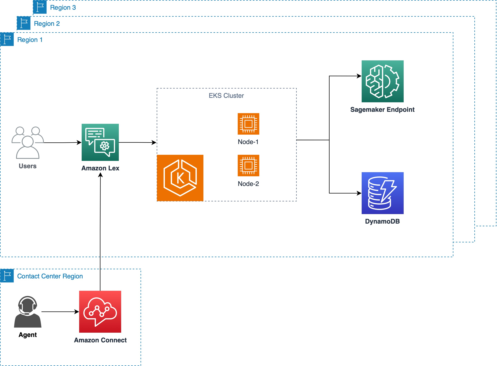
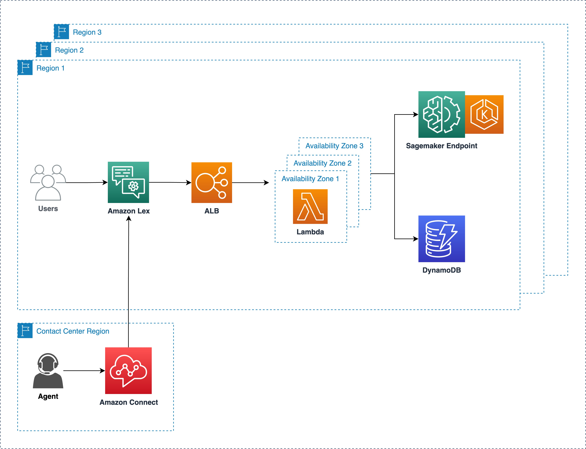
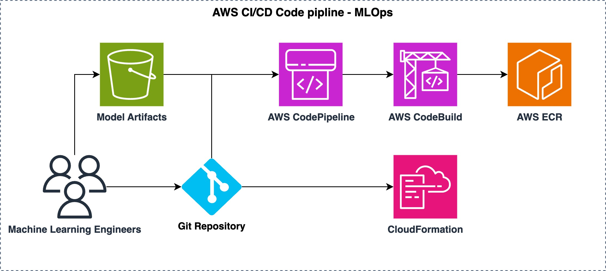

# LLM-Chatbot-AWS

## Overview

- Deployed Language Model (LLM) powered chatbots in AWS.
- Addressed business and technical requirements for a highly available chatbot solution.
- Explored two architectures: AWS Elastic Kubernetes Service (EKS) and serverless with AWS Lambda.
- Conducted Kubernetes experiments for horizontal pod scaling using Locust.
- Managed SageMaker endpoints using ACK and implemented autoscaling policies through Kubernetes.
- Utilized the Flan-UL2 model deployed as a SageMaker endpoint for enhanced language understanding.
- Integrated the LLM agent with Amazon Lex, enabling its use as a chatbot on websites and AWS Connect.

## Prerequisites

Ensure you have the following prerequisites before deploying the chatbot:

- AWS account with necessary permissions
- AWS CLI installed and configured
- Kubernetes tools (kubectl & eksctl) for EKS deployment
- Locust for Kubernetes experiments

## Getting Started

Follow these steps to get started with deploying LLM powered chatbots in AWS:

1. Clone the repository to your local machine:

   ```bash
   git clone https://github.com/your-username/your-repository.git
   ```
2. Review the proposed `architectures` in the architectures directory and choose the one that suits your requirements.

3. Follow the instructions in the `docs` directory for detailed documentation on deploying and managing the chatbot.

4. For kubernets experimentation check `experiments` directory.

## Architecures

### AWS EKS Architecture


### Serverless Architecture with AWS Lambda



### MLOps Pipeline

